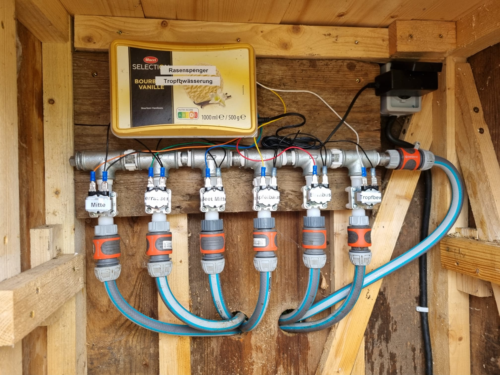
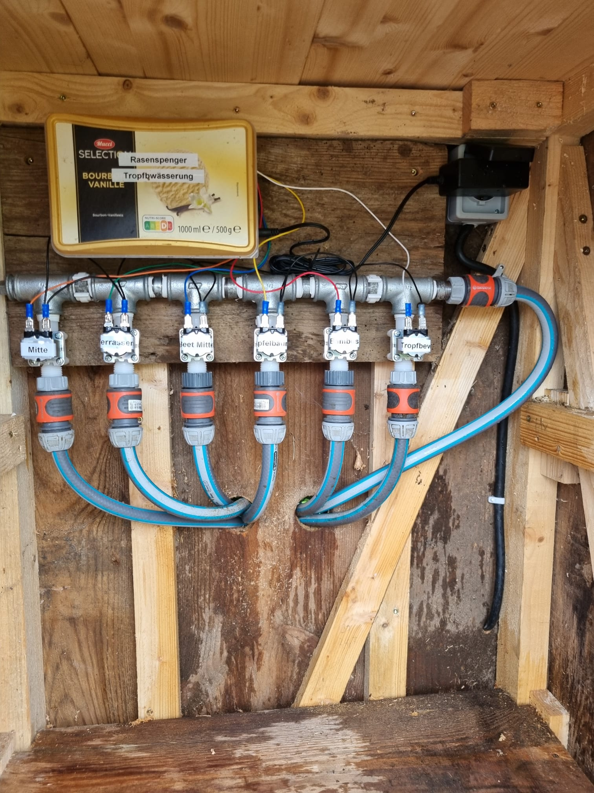
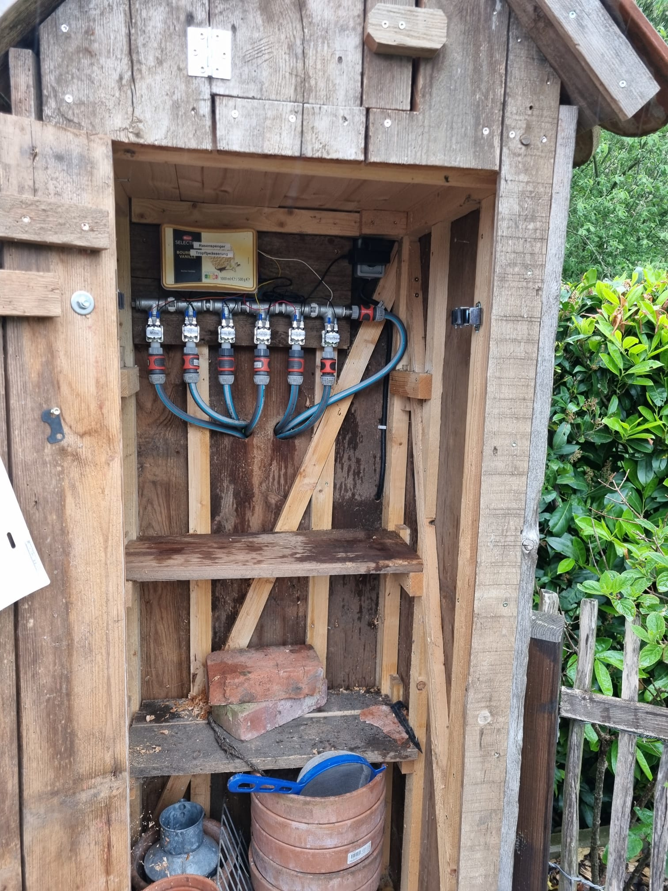

# Smart-Home-Lawn-Sprayer
A smart way to automate your sprinkler system using 12V solenoid valves and an ESP8266 (ESP-Home). Part of my [Smart-Home collection](https://github.com/Pytonballoon810/Smart-Home).

## Parts

*As I live in Germany you might find some links not to work or be too expensive with shipping. Please search some suitable replacements*

- [ESP8266](https://amzn.eu/d/jcvoaGJ) (I used a AZDelivery D1 Mini NodeMcu)
- [1/2" 12V Solenoid Valves](https://de.aliexpress.com/item/4000325042438.html) (I recommend normally closed (NC) ones since these would not run when no power is connected)(I used 6)
- [12V Relay Board](https://de.aliexpress.com/item/1005002867727977.html) (I used a 6 channel one)
- [12V to 5V Buck Converter](https://de.aliexpress.com/item/1005006482385645.html) (I used a LM2596 DC-DC)
- 12V Power Supply (I used a 12V 2A one but you can probably use a 12V 1A one if you have less than 6 solenoid valves. I also salvaged mine from an old network switch.)
- A box to put everything in (I used an old ice cream box)
- A DC Jack (I salvaged mine from an old router PCB i had laying around) (Note: You can also solder the power supply directly to the buck converter if you don't have a DC Jack laying around)
- Plumbing parts (I used some 1/2" cast iron fitting T's and some 1/2" male to male connectors
    + 6x [Malleable Iron Tee](https://www.mcm-systeme.de/Temperguss-T-Stueck-90-3x-Innengewinde-1-2)
    + 1x [Malleable Iron Threaded Plug](https://www.mcm-systeme.de/Temperguss-Gewindestopfen-Aussengewinde-1-2)
    + 6x [Galvanized Double Nipple made from Welded Pipe](https://www.mcm-systeme.de/Rohrdoppelnippel-verzinkt-aus-geschweisstem-Rohr-1-2-x-40-mm)
- [Hose Connectors](https://www.gardena.com/de/produkte/bewaesserung/ogs/hahnverbinder/970521301.html) (I used some 1/2" Gardena hose connectors. Although they are a bit expensive and 3rd party ones could probably also work, I had some trouble with the 3rd party ones not being as tight as the Gardena ones and in turn leaking.)
- [6.4x0.8mm Blade receptacles](https://amzn.eu/d/a4gvSK1) for connecting the relay board to the solenoid valves (you can also solder the wires directly to the relay board but I would recommend using some connectors in case you need to replace a solenoid valve)
- Wires (I used some old ATX power supply wires)
- Soldering Iron (I recommend the [Pinecil](https://pine64.com/product/pinecil-smart-mini-portable-soldering-iron/) from Pine64) and Solder (may also not be necessary if you use other connectors)
- Cable shoes (not necessary but recommended)
- Teflon tape (not necessary but recommended for connecting the solenoid valves to the cast iron plumbing parts and also those parts to themselves)

## Usage
1. Install the ESPHome addon in Home Assistant.
2. Copy the contents of the `sprinkler.yaml` file into a new ESPHome device.
3. Edit the `manual_ip` and `switch` sections to match your device. (Note: The `GPIO` notation of your device could be different if you use a different ESP(8266) board.) *I would recommend initializing the ESP [here](https://web.esphome.io/).*
4. Flash the device.
5. Connect the device to your relay board.
6. Connect the relay board to your solenoid valves.

## Images
How I did my wires. (Note: I used a 6 channel relay board, so I have 6 solenoid valves.)

Closed up the box.

I had a few leaks until I switched to the more expensive Gardena Hose connectors...

As you can see I put the whole construction on a wooden board to make it easier to transport and inside a small garden shed to protect it from the weather.
## Notes
- Try setting the `use_address` option to the ip you want Home Assistant to use to communicate with the device if you have problems with connecting to it.
- Disable the `mdns` setting if you have problems with the device not being found by Home Assistant or Home Assistant constantly using the wrong IP address. I personally had to disable it to get it to work.
- I would recommend using a 12V 2A power supply if you have 6 solenoid valves like me. If you have less than 6 solenoid valves you can probably use a 12V 1A power supply. I have not tested this but I think it should work. If you have trouble with you ESP being disconnected when the solenoid valves are activated you should probably use a power supply with a higher current rating.
- I would recommend using normally closed (NC) solenoid valves since these would not run when no power is connected. This is useful if you have a power outage or if you have to restart your ESP.
- I would recommend using a buck converter to convert the 12V to 5V for the ESP. You could also use a second USB power supply just for the ESP but I only wanted to use one cable for the whole device.
- I would recommend using a box to put everything in. I used an old ice cream box and the device itself will be in the shed in our garden so it wont get wet. If you plan on putting it outside you should probably use a waterproof box and add additional insulation to the cables.
- I would recommend using some good quality hose connectors. I had some trouble with the 3rd party ones not being as tight as the Gardena ones and in turn leaking. After switching to the Gardena ones I had no more leaks, even without using Teflon tape.